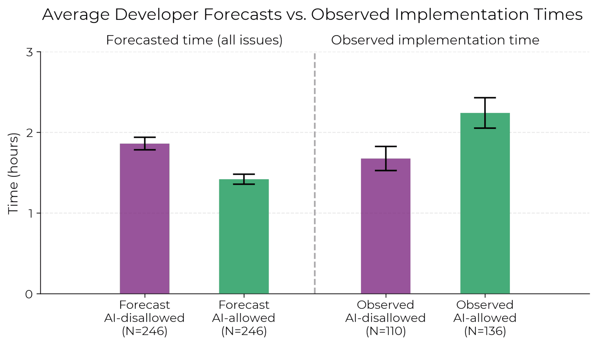
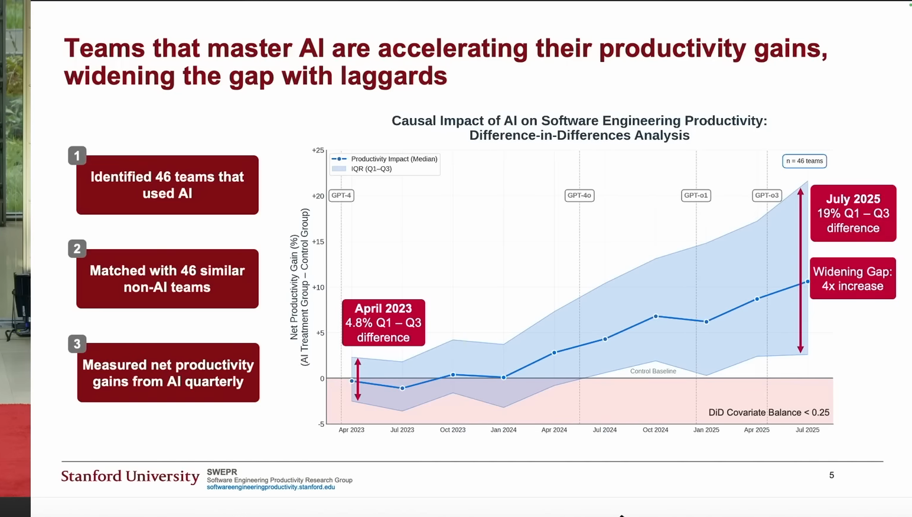
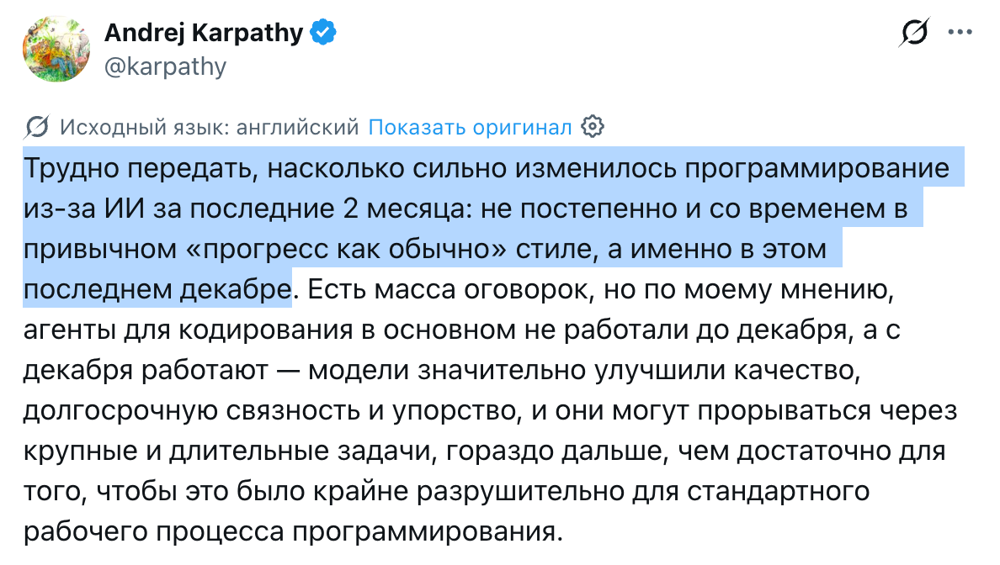
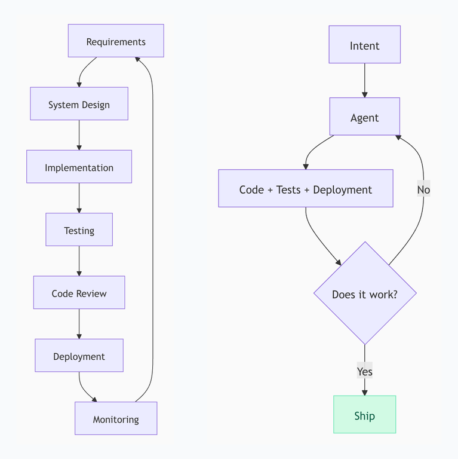
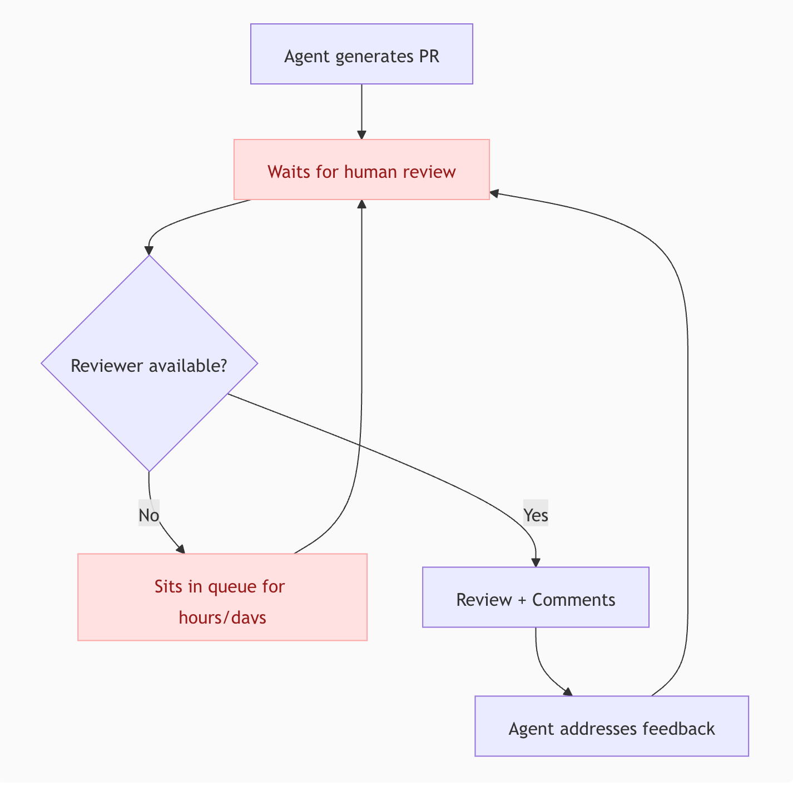
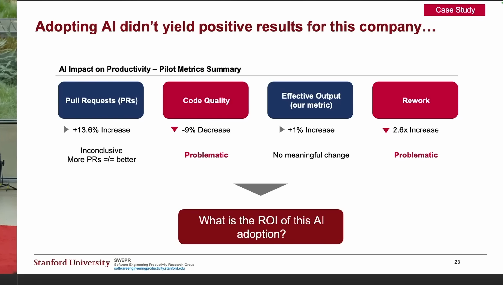

### AI-native SDLC. Грабли, на которые почти все наступают

Николай Шейко

- Кастомная ИИ разработка: [grably.tech](https://grably.tech)
- Онлайн конфы по ИИ: [entropy.talk](https://entropy.talk)
- Курс по агентам: [aiforwork.courses](https://aiforwork.courses)

Канал: [AI и грабли](https://t.me/ai_grably) — 13.7K подписчиков

---

### План

1. что уже происходит с SDLC
2. топ ошибок при внедрении ИИ
3. лайфхаки и best-practices
4. что ждет завтра (и как готовиться)

### Тренды прошлого

1. METR: ощущения ускорения 20%, реальность -20%

[METR, июль 2025](https://arxiv.org/pdf/2507.09089)

---

### Тренды прошлого

1. METR: ощущения ускорения 20%, реальность -20%
2. SWEPR: ускорение есть и разрыв растет

[SWEPR / Stanford, август 2025](https://aiconference.com/wp-content/uploads/2025/09/Yegor-Denisov-Blanch-Will-AI-Replace-Software-Engineers_-.pptx.pdf)

---

### Тренды прошлого

1. METR: ощущения ускорения 20%, реальность -20%
2. SWEPR: ускорение есть и разрыв растет
3. Karpathy: Агенты заработали

[Karpathy про декабрь 2025](https://x.com/karpathy/status/2026731645169185220)

---

### Тренды прошлого

1. METR: ощущения ускорения 20%, реальность -20%
2. SWEPR: ускорение есть и разрыв растет
3. Karpathy: Агенты заработали
4. Boris Tane: SDLC мертв

[Boris Tane: The Software Development Lifecycle is Dead](https://boristane.com/blog/the-software-development-lifecycle-is-dead/)

---

### Тренды прошлого

1. METR: ощущения ускорения 20%, реальность -20%
2. SWEPR: ускорение есть и разрыв растет
3. Karpathy: Агенты заработали
4. Boris Tane: SDLC мертв
5. Review - главный bottleneck

[Boris Tane: Review Curse](https://boristane.com/blog/the-software-development-lifecycle-is-dead/)

---

### Распределение времени

До ИИ:
- Plan: мало
- Dev: много
- Verify: средне

С ИИ сейчас:
- Plan: много
- Dev: меньше
- Verify: много

С ИИ завтра:
- Plan: средне
- Dev: ноль
- Verify: очень много

---

### Ошибка 1. Работа в синхронном режиме

Developer vs Engineering Manager
(CPU-bound vs IO-bound)

---

### Кейс 1: Перенос фронтенда на новый стек

- Компания оплачивает ИИ для команды
- Команда пользуется, но кто как умеет, централизированной настройки почти нет
- Перевозят фронт на новый стек, хотят ускорить за счет ИИ, заодно прокачаться

---

### Ошибка 2. Feedback Loop

- Агент пишет код
- Тестит человек в браузере

Решение

Агент сравнивает старый и новый фронт

---

### Ошибка 3. Слишком мало времени на планирование

- Команда вайбкодит в режиме кранча
- Потом архитектурные проблемы, которые блочат разработку
- Код возвращается на доработку, вся продуктивность съедается

Решение

- Планирование занимает несколько часов
- Агент в один заход делает реализацию

---

### Первые попытки

- Опросник для команды (для CLAUDE.md)
- Замыкание Feedback Loop (линтер, typescript, тесты, playwright/cdp)
- Участие в синках, корректировка решений команды

---

### Что могло пойти не так?

#### Ошибка 4. Делать внутренние инструменты внешнему эксперту

Проблема 1: Tacit Knowledge (неявные знания)

Проблема 2: Магический артефакт

---

### Что могло пойти не так?

#### Ошибка 5. Пытаться пушить сразу всех

Проблема 1: Разная степень сопротивления

Проблема 2: Разная степень "ИИ-нативности"

---

### Что могло пойти не так?

#### Ошибка 6. Учить пользоваться ИИ на примере переноса фронта

Плюсы:

- Можно граундиться об старую реализацию
- Все edge cases уже известны

Минусы:

- Тащим старые костыли
- Очень много архитектурной работы

---

### Решение

1. Централизованное сохранение сессий Claude Code
2. Отсматриваю вместе с агентом
3. Пишу фидбэк и планы для команды
4. Фокус на двух топ-перформерах

---

### Кейс 2: Аудит процессов в команде

- Европейский аутсорс
- Успехи есть, хотят больше

---

### Смотрим метрики

---

### Что показывают метрики?

1. Работы больше
2. Доработок тоже

---

### Ошибка 7. Считать не те метрики

Плохо:

- LOC
- Число коммитов
- Число PR
- Скорость выкатки фичей

Хорошо:

- Количество выполненных задач на единицу времени

> Задача выполнена, если не возвращается на доработку

Доп:

- Время жизни задачи
- Количество доработок
- Время на доработке

---

### Что узнали?

PR-ов много, но ревью всё тормозит

---

### Ошибка 8. Делать ревью вручную

Ревью становится боттлнеком

Либо тормозит процесс, либо снижается качество

Решение

Делать **вместе** с агентом

Хак: представьте, что он студент, который сдаёт вам экзамен

---

### Кейс 3: Большая кодовая база

Проклятье compaction

Агент упирается в лимит, делает compaction и пока восстанавливает контекст снова упирается в лимит

---

### Ошибка 9. Забивать на лучшие практики разработки

Протекшие абстракции -> агенту нужно много контекста.

Решение

- Деды придумали best practices
- Loose Coupling, High Cohesion
- Для выполнения задачи не нужен весь контекст
- Альтернатива: следить за индексом документации

---

### Ошибка 10. Использовать голый grep

Проблема:

grep на слишком больших кодовых базах = мусор

Решение

Использовать [ast search](https://github.com/defendend/Claude-ast-index-search)

Benchmarks on large Android project (~29k files, ~300k symbols):

| Command | ast-index | grep | Speedup |
| --- | --- | --- | --- |
| imports | 0.3ms | 90ms | 260x |
| dependents | 2ms | 100ms | 100x |
| deps | 3ms | 90ms | 90x |
| class | 1ms | 90ms | 90x |
| search | 11ms | 280ms | 14x |
| usages | 8ms | 90ms | 12x |

---

### Ошибка 11. Использовать одного исполнителя или мультиагентную систему

- Много агентов: глухой телефон на каждом стыке (менеджер знает X · Y · Z, исполнители получают обрывки)
- Один исполнитель: компакция выкидывает важные детали (требование, решение, грабля)

Решение

Прораб: умная модель держит цель, требования и приёмку, исполнитель делает руками. Исполнитель компактится, прораб помнит и следит

[Скачать скилл foreman.zip](./assets/skills/foreman.zip)

---

### Еще "забавные" кейсы-ошибки

- Миддл упоролся и выстроил весь AI SDLC в компании
- Ему отказались повышать зп на 50к

**Итог:** ушел в другую компанию на 150к+

---

### Еще "забавные" кейсы-ошибки

- Стартап пытался в spec-driven девелопмент
- Когда получали результат, все переделывали

**Итог:** сначала прототип, потом уже спека

---

### Что ждем завтра?

---

### Две роли

**Agentic Engineer**

- Оунит конкретную задачу
- Планирует, запускает агентов, валидирует результат
- Понимает продукт: без этого нет Plan и Review

**Agentic Operations**

- Оунит систему разработки
- Поддерживает skills, инструменты, шаблоны, метрики
- Убирает боттлнеки из SDLC

«Просто делать тикеты» теперь может агент

**Кто не смог в новый процесс — уходит**

---

### ПО больше не нужно

- Слева: агент → ПО → работа (агент строит конвейер, дальше работает ПО)
- Справа: агент → работа (агент сам делает работу через skills, scripts/, notes, cli, mcp, browser)

**90% моих заказов уже справа**

---

### Итоги: 11 ошибок

Разработчик:

1. Работать синхронно → вы теперь менеджер агентов
2. Не замыкать Feedback Loop → стат. анализ, тесты, e2e — проверяет агент
3. Мало планировать → 10 минут плана = часы и дни позже
8. Ревьюить вручную → ревью вместе с агентом
9. Забивать на best practices → локализация работы → меньше контекста
10. Искать голым grep → ast search
11. Один агент или рой агентов → прораб + исполнитель

Компания:

4. Отдать инструменты внешнему эксперту → agentic ops из команды
5. Пушить сразу всех → пара энтузиастов на команду
6. Учиться на задаче с высокой ценой ошибки → дашборды, админки, автоматизация
7. Считать LOC, коммиты, PR → поток задач до финала

---

### Итоги: Что делать? Долгосрок

- Попробуйте стать "чемпионом внутри команды" *(оунить SDLC)*
- Вкатываться сейчас, пока подписки еще +- жирные
- Стараться вытачивать систему до one-shot
- Автоанализ сессий на уровне команды *(а-ля ретро)*

---

### Итоги: Что делать? Короткосрок

- Замкните Feedback Loop *(статик анализ, тесты – unit/e2e, manual-e2e)*
- Напишите скилл, который анализирует сессии за день
- Скачать wisprflow/handy *(или хоткей в codex)*

---

### Еще один важный пункт

Не напрягайтесь слишком сильно из-за новых инструментов

Самое важное само вас найдет. А еще обязательно встроится в Codex и Claude Code.

Примеры - dispatch, memory, skills, todolist, /goal (ralphloop), etc

---

### Финал

Вопросы

слайды: [grably.tech/slides/datafest-2026](https://grably.tech/slides/datafest-2026)

видео:

[Can you prove ROI in Software Eng (16 минут)](https://www.youtube.com/watch?v=JvosMkuNxF8)

[Куда двигается найм (1,5 часа)](https://www.youtube.com/live/y2NnheH1-eU)

[Как не просрать карьеру в эпоху ИИ (18 минут)](https://www.youtube.com/watch?v=AW4gLWLrzcw)
