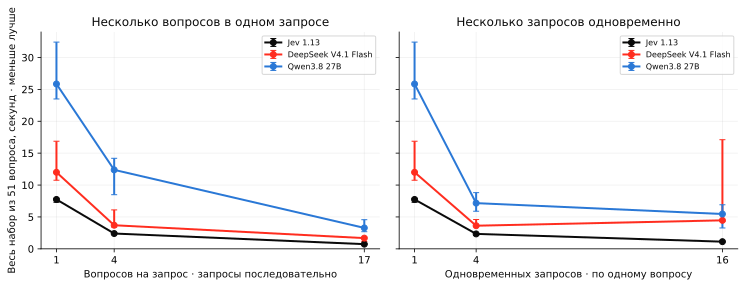
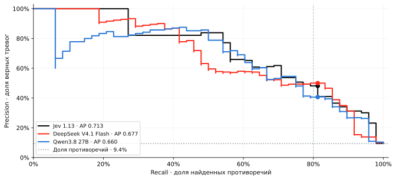
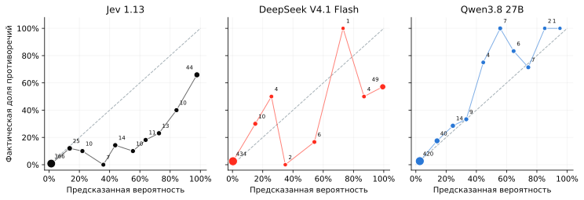

# Jev и LLM: где разница имеет значение

24 сентября 2026 · Jev 1.13 · DeepSeek V4.1 Flash · Qwen3.8 27B · обе LLM без reasoning

Вокруг Jev поднялся шум: модель не пишет тексты, а сразу выбирает вариант ответа и выдаёт вероятности. Но превращать языковую модель в классификатор умели и раньше: попросить один символ вместо ответа, например 0, 1 или 2, и взять logprobs этих токенов. Получится и метка, и оценка каждого класса.

Отсюда наш вопрос: **что Jev даёт сверх этого приёма?** Быстрее обрабатывает текст? Точнее выбирает ответ? Выдаёт вероятности, которым можно верить? Мы сравнили её с двумя обычными LLM на публичных данных, чтобы отделить измеримые преимущества от новизны подачи.

Это проверка готовых API, а не архитектуры. По ней можно судить о пользе Jev в похожих задачах, но нельзя установить, что у неё внутри.

### Кого и как сравнивали

**Jev** — модель компании TypeSafe. Её API принимает текст и вопрос с набором вариантов (до 255), а возвращает выбранный вариант и вероятности по всем вариантам сразу. К одному тексту можно задать несколько вопросов в одном вызове: по документации текст обрабатывается один раз, а вопросы оцениваются независимо. Мы проверяем результат и скорость этого API, но не его устройство. [Документация Jev](https://docs.typesafe.ai/models) · [Контракт API](https://docs.typesafe.ai/primitives/choice).

**LLM** — DeepSeek V4.1 Flash и Qwen3.8 27B. Критерий выбора простой: доступные быстрые и недорогие API с рабочими logprobs и отключаемым reasoning. Мы не пытались выбрать самые точные LLM и не подбирали паритет по цене, размеру или железу, поэтому результат нельзя обобщать на все языковые модели. DeepSeek закреплён за Together, Qwen за Parasail через OpenRouter; Jev — родной API TypeSafe. [Qwen3.8 27B](https://openrouter.ai/qwen/qwen3.8-27b) · [DeepSeek V4.1 Flash](https://openrouter.ai/deepseek/deepseek-v4.1-flash).

**Baseline для LLM.** Тот же текст и инструкция вернуть короткий код класса, без JSON Schema. Режимы отличаются. В бинарных и трёхклассовых одиночных опытах LLM генерирует один токен, и вероятность класса — это exp(logprob) его кода, нормированная на сумму вероятностей допустимых кодов. На BANKING77 код класса может состоять из нескольких токенов, и там сравниваем только метку. На 17 вопросов к одному тексту LLM возвращает 17 кодов подряд. В скоростном опыте LLM отдают короткий код без logprobs даже на одиночный вопрос. У Jev берём поле `probabilities`.

**Данные.** ANLI — 300 коротких, но сложных выводов из текста: три класса. ContractNLI — 30 договоров, к каждому 17 утверждений, всего 510 пар текст/утверждение: подтверждено, противоречит, сведений недостаточно. BANKING77 — 385 обращений в банк, по 5 на каждое из 77 намерений. Все три набора публичные и англоязычные.

### Четыре проверки

- **Качество выбора метки.** Три задачи, macro-F1. Специализация Jev могла дать более точные ответы, но LLM могли оказаться не хуже. [→ 01](#quality)
- **Скорость на многих вопросах.** Jev штатно берёт несколько вопросов к тексту. Но LLM тоже можно дать 17 вопросов в одном промпте или отправить 17 запросов параллельно. Проверяем, остаётся ли преимущество при обоих способах. [→ 02](#shared)
- **Меньше ложных тревог.** Отдельный бинарный опыт на ContractNLI: есть противоречие или нет. Сравниваем precision при одинаковом recall, чтобы не путать качество с привычкой чаще отвечать «да». [→ 03](#pr)
- **Вероятности, которым можно верить.** На тех же бинарных ответах: если модель обещает 80%, противоречие должно встречаться примерно в 80% таких случаев. [→ 04](#probabilities)

Обратите внимание: ContractNLI участвует дважды. В разделе 01 это трёхклассовая задача, где проверяем метку. В разделах 03 и 04 это отдельный бинарный прогон по тем же 510 парам, где проверяем score. Это не одни и те же ответы, схлопнутые в два класса.

## 01 · Где лучше качество {#quality}

**Macro-F1, выше лучше.** Каждый класс весит одинаково, поэтому редкие классы не теряются.

| Публичный поднабор | Jev 1.13 | DeepSeek V4.1 Flash | Qwen3.8 27B |
|---|---|---|---|
| ANLI · 300 · один вопрос | **0.779** | 0.676 | 0.661 |
| ContractNLI · 510 · один вопрос | 0.734 | 0.689 | **0.760** |
| ContractNLI · те же 510 · 17 вопросов за вызов | 0.735 | **0.736** | 0.582 |
| BANKING77 · 385 · 77 классов | **0.773** | 0.654 | 0.769 |

Jev выше на ANLI. На одиночных вопросах к договорам выше Qwen. На BANKING77 Jev и Qwen близки. Общего рейтинга нет: задачи разные, и победитель зависит от задачи.

**Два режима на ContractNLI** отличаются не только упаковкой вопросов. В одиночном режиме метка LLM берётся из logprobs одного токена, в 17-вопросном — из сгенерированной последовательности кодов. Поэтому рост DeepSeek с 0.689 до 0.736 — наблюдение, а не изолированный эффект группировки. Точно так же равенство 0.734 и 0.735 у Jev не доказывает, что она оценивает вопросы независимо: одинаковая метрика ничего не говорит о механизме. Независимость вопросов остаётся словами поставщика.

**Полнота ответов Qwen.** В 9 из 30 вызовов с 17 вопросами Qwen вернула не то число кодов; все 17 решений такого вызова засчитаны как ошибки. У Jev и DeepSeek таких сбоев не было. Это слабость нашего формата коротких кодов без схемы, а не доказательство, что Qwen не решает сами вопросы. Исправит ли это JSON Schema и какой ценой, мы не проверяли.

**Про полный вектор вероятностей.** На BANKING77 сравниваем только метки. Jev отдаёт вероятности всех 77 вариантов сразу; у выбранных LLM top-20 logprobs этот вектор не покрывает, а код класса может состоять из нескольких токенов.

## 02 · Два способа ускорить одну и ту же работу {#shared}

**Работа одна: 51 решение — 17 вопросов к каждому из трёх договоров.** Ускорить можно двумя способами. Слева на графике вопросы упакованы в один вызов: 1, 4 или 17 вопросов на запрос, запросы подряд. Справа каждый вопрос — отдельный запрос, а параллельно уходит 1, 4 или 16 запросов. Числа 16 и 17 не связаны: 17 — утверждений в договоре, 16 — просто уровень нагрузки в сетке. По оси Y — время завершения всего набора, точки — медиана трёх повторов, полоски — минимум и максимум.

| Модель | По одному, подряд · с | По 17 в запросе · с | По одному, 16 одновременно · с | Стоимость 1000 решений · режим 17 в запросе |
|---|---|---|---|---|
| Jev 1.13 | 7.75 | 0.73 | 1.12 | $0.014 |
| DeepSeek V4.1 Flash | 12.01 | 1.68 | 4.47 ‡ | $0.026 |
| Qwen3.8 27B | 25.85 | 3.28 † | 5.46 | $0.031 |

Jev быстрее в каждом измеренном режиме. У всех трёх 17 вопросов в одном вызове дали минимальное время: контекст передаётся один раз. Параллельные одиночные запросы тоже помогают, но контекст уходит повторно, и провайдер лишь иногда переиспользует его через cache. Такой параллелизм доступен всем трём API, поэтому нельзя сравнивать многовопросный Jev с последовательными вызовами LLM и весь выигрыш приписывать модели. Это замер на трёх договорах, на другие нагрузки его не переносим.

Стоимость посчитана по сохранённому usage для режима 17 вопросов в запросе с учётом cache; на другие режимы это число не распространяем.

**Что именно измерено.** Полное время ответа API с одного сервера в США (IP 107.172.73.82), без SSH. Сеть, очереди, cache и вычисления провайдера здесь не разделить, первые соединения включены. LLM в этом опыте отдают коды без logprobs, а Jev — вероятности штатно; скорость выдачи полного вектора вероятностей у LLM не измерялась.

**Сноски.** † Qwen: в режиме 17 вопросов 1 из 9 вызовов вернул неполный набор кодов; время учтено, качество здесь не оценивается — оно в таблице macro-F1. ‡ DeepSeek: в режиме 16 параллельных запросов часть первых попыток получила HTTP 503. Всего по скоростной серии у DeepSeek 4 таких ошибки на 513 вызовов во всех режимах и повторах, у Jev и Qwen 0 на 513. Время первой попытки включено в замер, диагностический повтор исключён.

## 03 · Меньше ложных тревог при нужном recall {#pr}

**Задача — найти противоречие в договоре.** Здесь отдельный бинарный опыт: те же 510 пар, тот же вопрос всем трём моделям с двумя вариантами ответа. Противоречий 48 из 510 (9.4%), подтверждённые и неизвестные утверждения — класс «нет противоречия». Модель выдаёт вероятность противоречия; этот score используется и здесь, и в разделе 04.

**Recall:** сколько настоящих противоречий нашли. **Precision:** какая доля тревог верна. Каждый порог даёт свою точку на кривой; при нужном recall выбираем кривую выше — она даёт меньше ложных тревог.

| Модель | Average Precision ↑ | Precision при recall 81.25% | Верные / ложные тревоги |
|---|---|---|---|
| Jev 1.13 | 0.713 | 48.1% | 39 / 42 |
| DeepSeek V4.1 Flash | 0.677 | 50.0% | 39 / 39 |
| Qwen3.8 27B | 0.660 | 40.6% | 39 / 57 |

Точку recall ≈ 80% мы выбрали как иллюстративный рабочий ориентир, не как требование продукта. На выборке ближайший достижимый шаг у всех трёх — 39 из 48 противоречий, 81.25%, без интерполяции. При другом требуемом recall соотношение кривых меняется, поэтому смотрите на всю кривую, а не только на точку 80%. Порог на тестовой кривой описывает этот тест, а не готовый production-порог.

**Average Precision** сводит всю кривую в одно число. У Jev оно численно выше на этой выборке, но это не выигрыш в каждой точке.

**Насколько это надёжно.** Интервалы считали bootstrap-ом по целым договорам. Precision в выбранной точке: DeepSeek − Jev = +1.9 п.п., 95% интервал [−13.2; +14.3]; Qwen − Jev = −7.5 п.п., [−20.9; +13.7]. AP: DeepSeek − Jev = −0.037, [−0.102; +0.025]; Qwen − Jev = −0.053, [−0.120; +0.028]. Все интервалы включают ноль: статистический победитель не установлен ни по AP, ни в выбранной точке. Равенство этим тоже не доказано — выборка просто мала. Что видно без статистики: около выбранного recall у Jev и DeepSeek примерно половина тревог ложная. Удобный API сам по себе проблему качества не решает.

## 04 · Можно ли верить вероятностям {#probabilities}

**Большое число ещё не значит надёжную вероятность.** Здесь те же бинарные score, что и в разделе 03: p — вероятность противоречия, не вероятность того, что модель права. Если модель выдаёт 0.8, среди многих таких случаев противоречие должно встречаться примерно в 80%. На графике диагональ — идеальное совпадение; точка ниже диагонали означает, что модель завышает вероятность противоречия. Числа у точек — размер группы.

**Монотонность — отдельное полезное свойство.** Чем выше предсказанная вероятность, тем чаще должно встречаться противоречие. Для этого кривая должна в целом расти; для хорошей калибровки — ещё и попадать на диагональ. Поэтому модель может завышать вероятности, но всё же давать полезный сигнал: «здесь риск выше, здесь ниже».

У Jev этот рост визуально ровнее, чем у DeepSeek: начиная с группы 50–60%, фактическая частота последовательно растёт от 10% до 66% в верхней группе. Но строгой монотонности на всём диапазоне нет и у Jev. У Qwen тоже виден общий рост с локальными спадами. Скачки DeepSeek выглядят резче, однако часть точек построена всего по 1–4 примерам: например, 100% в группе 70–80% — это одно противоречие из одного случая. Поэтому более ровная кривая Jev — обнадёживающее наблюдение на этой выборке, а не доказанное преимущество. Она также не заменяет PR-кривую: та проверяет полезность ранжирования без такого разбиения на группы.

**Самая уверенная группа, p ≥ 90%.** Jev: обещано 97.7%, противоречие в 65.9% случаев, 44 примера. DeepSeek: 99.3% → 57.1%, 49 примеров. Обе модели в этой зоне заметно самоуверенны. У Qwen в этом диапазоне один пример — судить не по чему.

| Модель | Brier ↓ | ECE ↓ |
|---|---|---|
| Jev 1.13 | 0.081 | 8.8 п.п. |
| DeepSeek V4.1 Flash | 0.075 | 7.3 п.п. |
| Qwen3.8 27B | 0.050 | 1.6 п.п. |

**Brier** — среднее `(p − y)²`, где `y = 1`, если противоречие есть. Ориентир для масштаба: постоянный прогноз 9.4%, то есть частота противоречий в этой же выборке, даёт Brier 0.085. Jev и DeepSeek выигрывают у него немного, Qwen — заметно. Но постоянный прогноз не отличает один случай от другого, поэтому малый Brier не отменяет пользу ранжирования из раздела 03.

**ECE** — средний разрыв между обещанной вероятностью и реальной частотой по десяти группам, с весом по числу примеров. Редкие группы шумные: у Qwen почти все примеры лежат в нижней группе, и низкий ECE во многом оттуда.

**Qwen лучше по Brier и ECE, хотя ниже по AP.** Это разные свойства: можно аккуратно оценивать вероятность и при этом давать больше ложных тревог при требуемом recall. Всё это исходные числа моделей без посткалибровки; посткалибровка за рамками отчёта, и мы не обещаем, что она что-то исправит.

## 05 · Что выяснили и чего не доказали

### Где преимущество Jev видно

**Скорость.** Jev была быстрее в каждом проверенном режиме. При 17 вопросах за вызов весь набор из 51 решения занял 0.73 с против 1.68 с у DeepSeek и 3.28 с у Qwen. Это время API-маршрута, а не чистые вычисления модели, и у Qwen один из девяти ответов в этом режиме был неполным.

**Полный вектор вероятностей.** На 77 классах Jev возвращает вероятности всех вариантов сразу; выбранные LLM с top-20 logprobs этого не дают. Несколько вопросов к тексту у Jev — штатный режим. У LLM в нашем формате коротких кодов без схемы полноту ответа приходится проверять отдельно; проверил бы её JSON Schema, мы не измеряли.

### Где общего превосходства нет

**Качество зависит от задачи.** Jev выше на ANLI, Qwen выше на одиночных вопросах к договорам, на BANKING77 они близки.

**Вероятности Jev не лучше автоматически.** AP у Jev численно выше, но интервалы включают ноль: победитель по ранжированию не установлен. По совпадению вероятности с реальной частотой лучше Qwen. Уверенные ответы Jev заметно завышены.

### Что это значит для «новизны»

Классификация с вероятностями сама по себе не новая возможность: наш простой baseline «LLM + logprobs» работает. Но и списывать Jev на маркетинг нельзя: в этих замерах есть выигрыш по скорости и удобный полный вектор вероятностей. Ни новую архитектуру, ни универсальное превосходство, ни равенство с LLM мы не доказали. Практический выбор — по своей задаче: скорость и удобство отдельно, точность и надёжность вероятностей отдельно.

**Есть и практический пробел в LLM API.** Приём «один токен + logprobs» требует доступа к вероятностям токенов, а у ряда новых моделей его нет в доступном API. Например, при проверке каталога OpenRouter 1 октября 2026 года у Gemini 3.8 Flash и Claude Sonnet 5.5 параметры `logprobs` и `top_logprobs` не заявлены; у выбранных DeepSeek и Qwen они есть. Это ограничение конкретного API, а не способности модели классифицировать. [Поддерживаемые параметры моделей](https://openrouter.ai/docs/guides/overview/models#supported-parameters) · [Каталог API](https://openrouter.ai/api/v1/models).

В этом смысле Jev и подобные специализированные модели закрывают реальную потребность: возвращают оценки всех заданных вариантов через интерфейс, прямо предназначенный для классификации и нескольких вопросов к тексту. Не нужно искать подходящую пару модель/провайдер, сопоставлять классы с токенами и проверять, поместились ли они в top-k. Новизна здесь может быть в доступности и удобстве уже знакомой возможности — даже без универсального выигрыша по качеству и без гарантии калиброванных вероятностей.

**Границы опыта.** Две LLM выбраны по доступности, рабочим logprobs и отключаемому reasoning, а не как самые точные; на все LLM результат не обобщается. Публичные англоязычные поднаборы могли попадать в предобучение. Бинарные вероятности проверены только на ContractNLI: 30 договоров, 48 противоречий; разметку не меняли. Замеры качества Jev и DeepSeek — 21–22 сентября, Qwen — 24 сентября, все скоростные режимы — 24 сентября. Сравниваются доступные API-маршруты, не одинаковое железо.

[Полные метрики и score](./assets/evidence.json) · [Таблица качества CSV](./assets/metrics.csv) · [Протокол](./protocol.md) · [Проверка сырых ответов](./assets/verification.json). Данные: [ANLI](https://github.com/facebookresearch/anli), [ContractNLI](https://stanfordnlp.github.io/contract-nli/), [BANKING77](https://github.com/PolyAI-LDN/task-specific-datasets).
